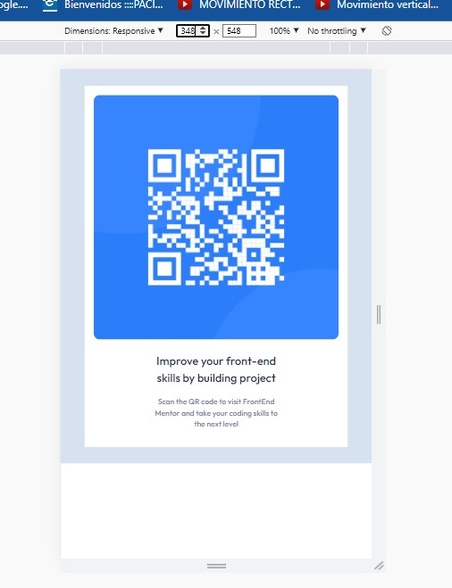
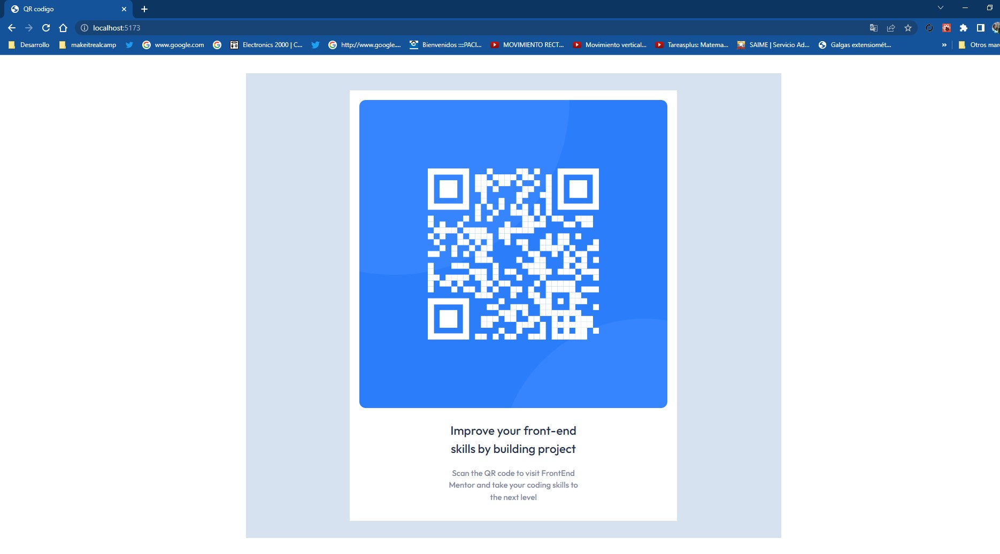

# Make It Real - QR code component

This is a solution to the react QR project with components


## Table of contents

- [Overview](#overview)
  - [The challenge](#the-challenge)
  - [Screenshot](#screenshot)
- [My process](#my-process)
  - [Built with](#built-with)
  - [What I learned](#what-i-learned)
  - [Continued development](#continued-development)
  - [Useful resources](#useful-resources)
- [Author](#author)
- [Acknowledgments](#acknowledgments)


## Overview :
-It is a program where REACT is practiced, we learned how to create the project with npm create vite, we entered a component with the export modules, we also handled how to enter an image.

### The challenge

-Enter a component and images

-work with react and components.

- we also work css
to give the styles

### Screenshot





## My process
- REACT: ⭐️
- CSS: ⭐️⭐️⭐️
- HTML: ⭐️⭐️⭐️


### Built with
- REACT
- Semantic HTML5 markup
- CSS
- Flexbox
- Mobile-first workflow
- Responsive web design

### What I learned


I practiced and learned react principles like creating a component, entering an image.

-example:

```jsx
import React from 'react'
import qr2 from './image-qr-code.png'
import './componente01.css'

export const componente01 = () => {
  return (
    <>
    <div className='container'>
        <div className="card">
            
        <div className="card__texto">
            <h2 className='car__texto--h'>Improve your front-end <br />
                skills by building project</h2>
            <p className='car__texto--p'>Scan the QR code to visit FrontEnd <br />
                Mentor and take your coding skills to <br />
                the next level</p>
        </div>
        </div>
    </div>
    </>
  )
}

export default componente01;
```
``` jsx
function App() {
  
  return (
    <>
      <Componente01/>             
    </>
  )
}
```
### Continued development
- I will continue practicing to have a better command with react, enter images that cost me, also practice more css

 ### Useful resources
- https://classroom.makeitreal.camp/courses/82/topics/353/progress -- This helped me I will use it in the future.
- https://es.react.dev/

## Author

- email - [guialexander1@gmail.com]
- Twitter - [@guialexander1](https://www.twitter.com/guialexander1)
- github: [guialexander]()

## Acknowledgments

-I want to thank the make it real family since it has given me a new vision of my working life to improve and get out of the comfort zone and know that we can give more than what we already know
